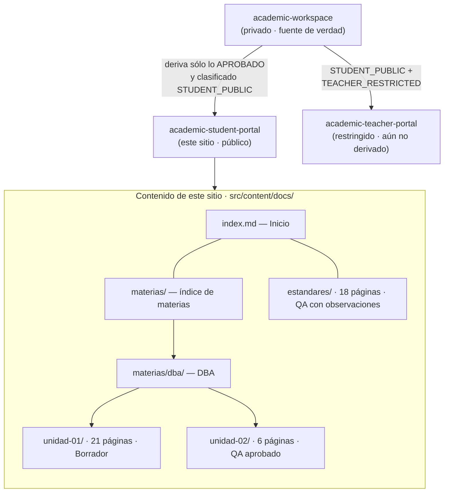
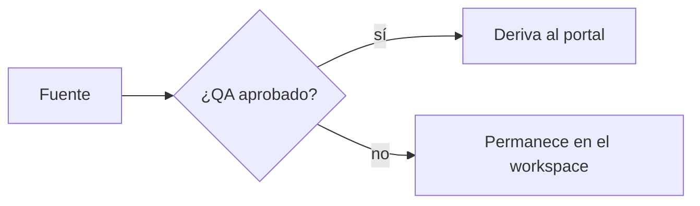

<span class="badge-estado">Referencia del portal</span>

Esta página lista **todo el contenido publicado actualmente** en el Portal del
Estudiante, su estado de aprobación y cómo está organizado. Sirve como índice
de navegación y como referencia técnica para quien mantiene el sitio.

:::note[De dónde viene este contenido]
Nada se escribe directamente en este portal. Todo se **deriva** desde un
espacio de trabajo académico interno (`academic-workspace`), que es la única
fuente de verdad. Aquí solo se publica contenido ya producido y filtrado para
audiencia estudiantil. El detalle del procedimiento está en
`docs/PUBLICACION.md` y `docs/ARQUITECTURA.md` del repositorio.
:::

## Arquitectura del contenido



## Inventario actual

Total: **48 páginas de contenido** en tres bloques.

### 1. Estructura general

| Página | Ruta | Propósito |
|---|---|---|
| Inicio | `/` | Portada del portal y alcance. |
| Materias | `/materias/` | Índice de materias; marca las que están en preparación. |
| DBA (presentación) | `/materias/dba/` | Propósito general de la materia *Gestión de Seguridad y Desempeño de Bases de Datos*. |

### 2. DBA — Unidad 1: Introducción a la Gestión de Bases de Datos

<span class="badge-estado">Borrador — QA requiere nueva verificación</span> <span class="badge-estado">Publicación no autorizada</span>

**21 páginas.** Contenido publicado como avance; no debe citarse como definitivo.

| Grupo | Páginas |
|---|---|
| Introducción | `unidad-01/` |
| Temas (manual) | `01-rol-del-dba` · `02-responsabilidades-operativas` · `03-ambientes-de-trabajo` · `04-arquitectura-relacional` · `05-arquitectura-nosql` · `06-cierre-y-autoevaluacion` |
| Actividades | `actividades/actividad-1` … `actividad-7` (la 7 es la evidencia oficial) |
| Laboratorios | `laboratorios/laboratorio-1-postgresql` · `laboratorios/laboratorio-2-mongodb` |
| Evaluación | `unidad-01/evaluacion` |
| Presentación | `unidad-01/presentacion` |
| Referencias | `referencias/` (bibliografía) · `referencias/lecturas-complementarias` · `referencias/casos-reales` |

### 3. DBA — Unidad 2: Seguridad, privacidad y control de acceso

<span class="badge-estado">QA: aprobado</span> <span class="badge-estado">Validación académica: pendiente</span>

**6 páginas.** Primera unidad con dictamen de QA aprobado.

| Página | Ruta |
|---|---|
| Introducción | `unidad-02/` |
| Manual del estudiante | `unidad-02/manual-estudiante` |
| Actividades | `unidad-02/actividades` |
| Evaluación | `unidad-02/evaluacion` |
| Presentación | `unidad-02/presentacion` |
| Referencias | `unidad-02/referencias` |

### 4. Estándares de desarrollo (Engineering Handbook)

<span class="badge-estado">QA: aprobado con observaciones</span> <span class="badge-estado">Validación académica: pendiente</span>

**18 páginas.** Recurso transversal: cómo se construye el software de un
proyecto de la carrera. Es un estándar *de referencia*; su carácter obligatorio
lo define cada materia.

| Página | Ruta |
|---|---|
| Presentación | `estandares/` |
| Documentos del handbook | `estandares/00-indice` · `01-general` · `02-backend-laravel` · `03-frontend` · `04-bases-de-datos` · `05-api-rest` · `06-git` · `07-code-review` · `08-pruebas` · `09-seguridad` · `10-documentacion` · `11-calidad-cicd` · `12-definition-of-done` · `13-checklists` · `16-plan-implementacion` · `17-reglas-de-oro` |
| Configuración copy-paste | `estandares/config-examples` |

:::caution[Los documentos 14 y 15 no están aquí]
La *Matriz de verificación y cumplimiento* (Doc. 14) y la *Rúbrica de
evaluación técnica* (Doc. 15) tienen audiencia docente y se publicarán en el
Portal del Docente, no en este sitio.
:::

## Estados de publicación

Cada página lleva una o dos insignias que indican qué tan firme es su
contenido. No todas las páginas del portal tienen el mismo grado de avance.

| Insignia | Significado |
|---|---|
| `QA: aprobado` | Tiene un dictamen de control de calidad vigente en el workspace. |
| `QA: aprobado con observaciones` | Aprobado, con observaciones menores registradas y en su mayoría resueltas. |
| `Borrador — QA requiere nueva verificación` | Contenido en producción activa; el dictamen de QA no está vigente. |
| `Publicación no autorizada` | Se derivó como avance por decisión explícita, sin autorización formal de publicación. |
| `Validación académica: pendiente` | Falta la revisión final del responsable académico; el contenido puede ajustarse. |
| `Observacional — no evaluado` | Material de apoyo que no forma parte de la evaluación. |

:::tip[Cómo navegar]
Usa el menú lateral: cada materia y la sección *Estándares de desarrollo* se
expanden en sus páginas. El buscador (tecla `/`) indexa todo el contenido del
sitio, incluidos los bloques de código.
:::

---

## Para quien mantiene el portal

Esta sección es técnica y no es lectura obligatoria para el estudiante.

### Colección de contenido

Todo vive en una única colección de Starlight. El esquema es el estándar del
tema, sin campos personalizados:

```ts title="src/content.config.ts"
import { defineCollection } from 'astro:content';
import { docsLoader } from '@astrojs/starlight/loaders';
import { docsSchema } from '@astrojs/starlight/schema';

export const collections = {
  // docsLoader() carga todo src/content/docs/**; docsSchema() aporta el
  // frontmatter de Starlight (title, description, sidebar, prev/next, etc.).
  docs: defineCollection({ loader: docsLoader(), schema: docsSchema() }),
};
```

Estructura de carpetas de `src/content/docs/`:

```text
src/content/docs/
├── index.md                     # Inicio
├── mapa-de-contenido.md         # esta página
├── materias/
│   ├── index.md
│   └── dba/
│       ├── index.md
│       ├── unidad-01/           # 21 páginas (index, temas, actividades, labs, ...)
│       └── unidad-02/           # 6 páginas
└── estandares/
    ├── index.md
    ├── 00-indice.md … 17-reglas-de-oro.md   # 16 documentos del handbook
    └── config-examples.md
```

### Menú lateral

El árbol de navegación se define a mano en `astro.config.mjs`. Cada entrada
apunta a un `slug` (ruta sin extensión, relativa a `src/content/docs/`):

```js title="astro.config.mjs (extracto del sidebar)"
sidebar: [
  { label: 'Inicio', link: '/' },
  {
    label: 'Materias',
    items: [
      /* … DBA, unidades … */
    ],
  },
  {
    label: 'Estándares de desarrollo',
    items: [
      { label: 'Presentación', slug: 'estandares' },
      { label: '00 · Arquitectura documental', slug: 'estandares/00-indice' },
      // … un item por documento …
      { label: 'Archivos de configuración', slug: 'estandares/config-examples' },
    ],
  },
]
```

### Diagramas

Los bloques ` ```mermaid ` se renderizan con la integración `astro-mermaid`
(declarada **antes** de `starlight` en `astro.config.mjs`, con `autoTheme`
para seguir el modo claro/oscuro). No hace falta ningún componente ni import
en la página: basta el bloque de código.

---

## Plantillas

### Frontmatter mínimo de una página

```yaml
---
title: "Título de la página"          # obligatorio — es el <h1> y el <title> SEO
description: "Resumen en una frase."   # recomendado — meta description
# opcionales de Starlight:
# sidebar: { order: 2, label: "Etiqueta corta", badge: "Nuevo" }
# tableOfContents: { minHeadingLevel: 2, maxHeadingLevel: 3 }
# prev: false        # oculta el enlace "anterior"
# draft: true        # excluye la página del build de producción
---
```

### Insignia de estado

Se coloca inmediatamente después del frontmatter, antes del primer párrafo:

```html
<span class="badge-estado">QA: aprobado</span> <span class="badge-estado">Validación académica: pendiente</span>
```

### Bloque de diagrama

````markdown

````

### Blueprint de página nueva

```md title="src/content/docs/materias/<materia>/unidad-NN/<pagina>.md"
---
title: "Nombre de la página"
description: "Una frase que describe el contenido."
---

<span class="badge-estado">QA: aprobado</span> <span class="badge-estado">Validación académica: pendiente</span>

:::note[Contexto]
Enlace a la unidad o material del que forma parte esta página.
:::

## Sección

Contenido derivado desde `academic-workspace`. Las referencias cruzadas a
otros archivos del workspace se reemplazan por enlaces internos del portal
(`/materias/.../pagina/`).
```

### Configuración del sitio (pendiente de hosting)

`astro.config.mjs` no fija `site` todavía. Cuando se confirme el dominio de
GitHub Pages, se completa así (y el `sitemap` deja de omitirse):

```js title="astro.config.mjs"
export default defineConfig({
  site: 'https://ORG.github.io',   // organización/usuario real de GitHub Pages
  base: '/academic-student-portal', // sólo si NO se publica en la raíz del dominio
  // …
});
```

Equivalente como variables de entorno, si se prefiere parametrizar el build:

```bash
# .env  (leído en astro.config.mjs con import.meta.env / process.env)
PUBLIC_SITE_URL="https://ORG.github.io"
PUBLIC_BASE_PATH="/academic-student-portal"
```

## Construir y validar

```bash
npm install       # incluye astro-mermaid + mermaid
npm run build     # genera dist/ ; falla si hay enlaces internos rotos o frontmatter inválido
npm run preview   # sirve dist/ en local para revisar
```

:::caution[Antes de publicar]
El build actual advierte que falta `site` para generar `sitemap.xml`: es
esperado hasta confirmar el hosting. El despliegue a GitHub Pages se hace por
el workflow `.github/workflows/build.yml` del repositorio.
:::
