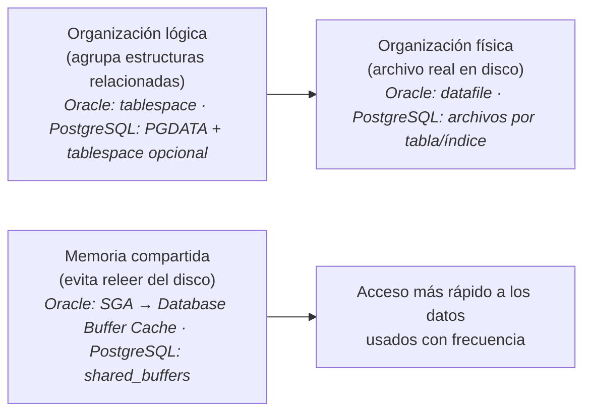

Borrador — QA requiere nueva verificación

## Antes de continuar: un repaso rápido

En materias anteriores ya trabajaste con el concepto de SGBD y con la
distinción entre bases de datos SQL y NoSQL. Antes de entrar a la
arquitectura, vale la pena recordarlos brevemente —**no es contenido
nuevo**, es el puente hacia lo que sigue.

> **SGBD (Sistema Gestor de Base de Datos, en inglés *Database
> Management System*, DBMS).** Tecnología de software que administra la
> información de una base de datos: permite leer, escribir, eliminar y
> actualizar datos, a la vez que busca aumentar su disponibilidad,
> confiabilidad y desempeño (REF-U1-11) — los mismos dos conceptos que
> ya trabajaste en
> [Responsabilidades operativas](/materias/dba/unidad-01/02-responsabilidades-operativas/).

A lo largo de esta unidad también vas a ver la palabra **motor** (por
ejemplo, "motor relacional", "motor de base de datos"): es el término
coloquial que se usa para referirse a un SGBD específico —un producto
real, como Oracle Database o PostgreSQL— cuando se habla de él en
concreto, en vez de la categoría general. Aquí "motor" y "SGBD" se usan
como sinónimos en ese sentido. Ninguno de los dos es lo mismo que "base
de datos": el motor/SGBD es el software. La base de datos es la
información que administra.

La forma en que un SGBD organiza esa información define su
**clasificación**:

* **Bases de datos SQL (relacionales)** — organizan los datos en tablas
  con filas y columnas, relacionadas entre sí mediante claves. Suelen
  cumplir con fuerza las propiedades **ACID** (atomicidad, consistencia,
  aislamiento y durabilidad), lo que las hace confiables para sistemas
  donde las transacciones deben procesarse con precisión (REF-U1-12).
* **Bases de datos NoSQL (no relacionales)** — no requieren un esquema
  fijo de tablas. Organizan los datos según distintos modelos (los
  cuatro que vas a ver en
  [Arquitectura NoSQL](/materias/dba/unidad-01/05-arquitectura-nosql/):
  documental, clave-valor, columnar y grafos), lo que les da mayor
  flexibilidad para escalar con grandes volúmenes de datos poco
  estructurados (REF-U1-12).

Con esto en mente, ahora sí: ¿cómo organiza sus datos, concretamente, un
SGBD relacional?

Para poder diagnosticar y tomar decisiones informadas en las unidades
siguientes, el DBA necesita comprender —a nivel conceptual— cómo
almacena y organiza la información el motor de base de datos que
administra. Todo SGBD relacional resuelve **dos problemas universales**,
sin importar el motor: dónde vive físicamente cada dato, y cómo acelerar
el acceso a los datos que se usan con más frecuencia. A continuación se
explica cada problema de forma genérica, y después cómo lo resuelve, en
concreto, más de un motor real — para que quede claro que el
**concepto** es universal aunque el **nombre** que le da cada motor no
lo sea.

> **Nota técnica.** El motor de referencia definitivo para esta materia
> todavía no se ha decidido. Por eso esta sección presenta el concepto
> primero, de forma independiente de cualquier motor, y usa Oracle y
> PostgreSQL únicamente como **ejemplos ilustrativos** de cómo se ve ese
> concepto en un producto real —el mismo patrón que se usa en
> [Arquitectura NoSQL](/materias/dba/unidad-01/05-arquitectura-nosql/)
> para los modelos NoSQL—, no como el motor "correcto" de la unidad.

## Problema 1: ¿dónde vive físicamente cada dato? (almacenamiento lógico y físico)

Todo SGBD relacional necesita distinguir dos niveles de organización:

* **Organización lógica** — un agrupamiento de estructuras relacionadas
  (tablas, índices) que el DBA puede administrar como una unidad, sin
  tener que pensar en archivos individuales.
* **Organización física** — el archivo o los archivos reales, a nivel de
  sistema operativo, donde esos datos quedan efectivamente guardados en
  disco.

**Cómo lo resuelve Oracle Database:** con un **tablespace** ("espacio de
tablas"), la unidad lógica que agrupa estructuras relacionadas, y un
**datafile** ("archivo de datos"), el archivo físico donde se guardan
realmente los datos de un tablespace. Un datafile pertenece únicamente a
un tablespace y a una sola base de datos (REF-U1-04: Oracle *Database
Administrator's Guide*, 18c, cap. 13 "Managing Tablespaces").

**Cómo lo resuelve PostgreSQL:** con un **directorio de datos**
(`PGDATA`), con subdirectorios por base de datos y archivos por tabla e
índice (REF-U1-06: PostgreSQL 18 Documentation, cap. 66 "Database
Physical Storage"). PostgreSQL también tiene el concepto de *tablespace*
como mecanismo adicional para decidir en qué ubicación física del disco
vive cada objeto, pero no es la unidad de organización por defecto de
todos los datos, como sí lo es en Oracle.

Dos motores, dos implementaciones distintas, el mismo problema resuelto:
**separar la organización lógica ("¿a qué grupo de datos pertenece
esto?") de la organización física ("¿en qué archivo del disco vive
realmente?")**.

## Problema 2: ¿cómo acelerar el acceso a los datos? (memoria y caché)

Leer un dato desde disco es mucho más lento que leerlo desde memoria
RAM. Por eso todo SGBD relacional reserva un área de memoria compartida
donde guarda temporalmente los datos leídos con más frecuencia, para no
tener que volver a leerlos del disco cada vez.

Antes de continuar, vale la pena definir una palabra que vas a usar en
esta sección: una **instancia** es la ejecución en memoria de un SGBD —
el conjunto de estructuras de memoria y procesos en segundo plano que
hacen funcionar al motor y le permiten administrar una o más bases de
datos. No es la base de datos en sí (los datos ya guardados). Es el
motor corriendo (REF-U1-05: Oracle *Database Concepts*, 19c, cap. 15
"Memory Architecture").

**Cómo lo resuelve Oracle Database:** con el **Área Global del Sistema**
(*System Global Area*, **SGA**), un área de memoria compartida que —junto
con los procesos en segundo plano del motor— conforma una instancia de
base de datos. Uno de sus componentes es el **Database Buffer Cache**
("caché de búfer de la base de datos"), el área específica donde se
guardan los datos leídos del disco (REF-U1-05).

**Cómo lo resuelve PostgreSQL:** con `shared_buffers`, el parámetro que
define el tamaño de la memoria compartida que el motor usa para el mismo
propósito: mantener en memoria las páginas de datos leídas recientemente
(REF-U1-06). No es idéntico al Database Buffer Cache de Oracle —cada
motor implementa detalles distintos—, pero cumple la misma función
dentro del mismo problema general.

## La conclusión que debes llevarte

No es memorizar "tablespace = Oracle, PGDATA = PostgreSQL". Es esto:
**todo SGBD relacional necesita (1) organizar su almacenamiento físico y
(2) usar memoria para acelerar el acceso a los datos**, aunque cada motor
lo llame y lo implemente de forma distinta. Si en el futuro trabajas con
un motor que no se haya mencionado aquí (SQL Server, MySQL, otro), vas a
poder reconocer ambos problemas y preguntar "¿cómo resuelve este motor la
organización física? ¿cómo resuelve el uso de memoria?", en vez de buscar
literalmente un "tablespace" que quizás ese motor no tenga.

El siguiente esquema resume el concepto universal de ambos problemas,
antes de que produzcas tu propio diagrama en la Actividad 5 (que sí debe
etiquetar específicamente la organización lógica/física y la memoria de
la instancia, usando de forma consistente la terminología de uno de los
dos motores —Oracle: tablespace, datafile, SGA, Database Buffer Cache; o
PostgreSQL: PGDATA, archivos de datos, `shared_buffers`—, con la función
de cada uno):

> **Actividad 5 — Diagrama de arquitectura de un SGBD relacional.**
> Instrucciones completas en la
> [Actividad 5](/materias/dba/unidad-01/actividades/actividad-5/). También
> puedes observar estos elementos en un PostgreSQL real, de forma
> opcional y no evaluada, en el
> [Laboratorio 1 — Arquitectura relacional (PostgreSQL)](/materias/dba/unidad-01/laboratorios/laboratorio-1-postgresql/).
