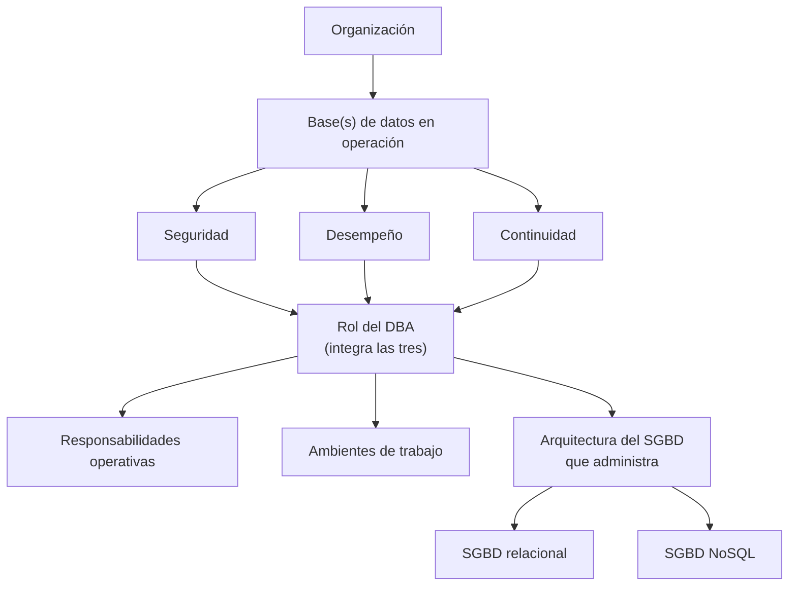

## Cierre: integrando todo lo aprendido

Vuelve a la [situación de la introducción](/materias/dba/unidad-01/):
una base de datos sin responsable técnico claro, sin ambientes separados
y sin documentación de su configuración, que termina fallando de forma
intermitente porque alguien modificó datos directamente en producción.

Con lo que trabajaste en esta unidad, ya puedes explicarla con
precisión. Faltaba alguien con la responsabilidad explícita del rol de
DBA. Esa falla es exactamente el tipo de problema que las
responsabilidades operativas cotidianas —monitoreo, diagnóstico,
documentación— deberían haber cubierto. Faltaba una separación real de
ambientes que impidiera modificar producción directamente. Y quien lo
hiciera necesitaba comprender, al menos a nivel conceptual, la
arquitectura de la base de datos que estaba administrando, relacional o
NoSQL.

Recorriste, en esta unidad: [el rol del DBA](/materias/dba/unidad-01/01-rol-del-dba/),
sus [responsabilidades operativas](/materias/dba/unidad-01/02-responsabilidades-operativas/),
la importancia de separar [ambientes](/materias/dba/unidad-01/03-ambientes-de-trabajo/),
y la arquitectura de almacenamiento tanto en un
[SGBD relacional](/materias/dba/unidad-01/04-arquitectura-relacional/)
como en un [SGBD NoSQL](/materias/dba/unidad-01/05-arquitectura-nosql/).

> **Actividad 7 — Mapa de responsabilidades del DBA y diagnóstico de un
> entorno (evidencia oficial de la unidad).** A partir de un entorno de
> base de datos descrito por tu docente, vas a elaborar un mapa de
> responsabilidades y un diagnóstico breve de su arquitectura y de la
> separación de ambientes. Instrucciones completas en la
> [Actividad 7](/materias/dba/unidad-01/actividades/actividad-7/).

## Autoevaluación

Responde sin consultar el manual. Después verifica tus respuestas con tu
docente.

1. Explica, con tus propias palabras, por qué el DBA no puede
   considerarse simplemente "la persona que sabe SQL".
2. Explica, con un ejemplo distinto a los del manual, por qué
   "seguridad" y "continuidad" son responsabilidades del DBA desde el
   primer día, y no algo que se agrega después de que la base de datos
   ya funciona.
3. En la situación inicial, alguien modificó datos directamente en
   producción. ¿Qué ambiente(s) faltaron, y qué riesgo concreto se
   materializó por esa ausencia?
4. Elige dos de las seis responsabilidades operativas y explica, con un
   ejemplo propio (no uno ya usado en el manual), cómo se verían en la
   práctica.
5. Explica la diferencia entre organización lógica y organización física
   del almacenamiento de un SGBD relacional, usando el ejemplo de
   cualquiera de los dos motores (Oracle o PostgreSQL).
6. ¿Por qué todo SGBD relacional necesita un área de memoria compartida
   para acelerar el acceso a los datos, sin importar cómo la llame cada
   motor?
7. Explica, sin usar la palabra "documento", en qué se diferencia
   conceptualmente el modelo clave-valor del modelo columnar.
8. Elige uno de los cuatro modelos NoSQL revisados (documental,
   clave-valor, columnar, grafos) y explica qué tipo de problema
   resuelve mejor que un SGBD relacional tradicional.
9. Define, con tus propias palabras, qué es un "ambiente" (no solo
   nombres los tres tipos, explica la definición formal).
10. En el caso de Knight Capital, el problema no fue "un servidor con un
    error" sino algo más específico. ¿Qué concepto de esta unidad
    explica exactamente qué falló?
11. En el caso de GitLab, identifica un elemento que corresponda a
    "responsabilidades del DBA" y otro que corresponda a
    "disponibilidad". Justifica brevemente cada uno.

## Glosario

| Término | Definición |
| --- | --- |
| DBA (*Database Administrator*) | Persona o equipo responsable de instalar, configurar, proteger, monitorear, optimizar y mantener operativa una base de datos. |
| SGBD / DBMS (*Database Management System*) | Software que administra la información de una base de datos, buscando aumentar su disponibilidad, confiabilidad y desempeño. |
| Base de datos SQL (relacional) | Base de datos que organiza los datos en tablas relacionadas mediante claves, con fuerte cumplimiento de propiedades ACID. |
| Base de datos NoSQL (no relacional) | Base de datos sin esquema fijo de tablas, organizada según distintos modelos (documental, clave-valor, columnar, grafos). |
| Ambiente | Conjunto independiente de infraestructura, configuración y datos sobre el cual se despliega y ejecuta un sistema, destinado a un propósito específico (desarrollo, pruebas, producción, y en la industria a veces *staging*). |
| Desempeño | Qué tan rápido y eficientemente responde una base de datos a las operaciones solicitadas. |
| Disponibilidad | Que una base de datos esté accesible y funcionando cuando se le necesita. |
| Seguridad de los datos | Responsabilidad del DBA de que solo quien debe ver o modificar un dato pueda hacerlo. Su mecanismo técnico se estudia en la Unidad II. |
| Continuidad | Responsabilidad del DBA de que la base de datos pueda seguir operando, o recuperarse, ante una falla. Su mecanismo técnico se estudia en la Unidad V. |
| Organización lógica (almacenamiento) | Concepto universal: agrupamiento de estructuras relacionadas (tablas, índices) que el DBA administra como unidad, sin importar el motor. Ejemplo Oracle: tablespace. |
| Organización física (almacenamiento) | Concepto universal: el archivo o archivos reales en disco donde viven los datos, sin importar el motor. Ejemplo Oracle: datafile. Ejemplo PostgreSQL: archivos dentro de `PGDATA`. |
| Tablespace | Unidad de almacenamiento lógico de una base de datos relacional que agrupa estructuras relacionadas (ejemplo de terminología: Oracle. PostgreSQL también tiene el concepto, con un alcance distinto). |
| Datafile | Archivo físico, a nivel de sistema operativo, donde se almacenan los datos de un tablespace (ejemplo de terminología: Oracle). |
| SGA (*System Global Area*) | Área de memoria compartida de una instancia de base de datos, que incluye el Database Buffer Cache, entre otros componentes (ejemplo de terminología: Oracle). |
| Database Buffer Cache | Componente de la SGA que guarda en memoria los datos leídos recientemente del disco, para acelerar accesos futuros (ejemplo de terminología: Oracle. Equivalente funcional en PostgreSQL: `shared_buffers`). |
| Modelo documental | Modelo de datos NoSQL que organiza la información en documentos con pares campo-valor (ejemplo: MongoDB). |
| Modelo clave-valor | Modelo de datos NoSQL que asocia una clave a un valor (ejemplo: Redis). |
| Modelo columnar (wide-column) | Modelo de datos NoSQL que organiza la información en tablas particionadas de filas y columnas (ejemplo: Apache Cassandra). |
| Modelo de grafos | Modelo de datos NoSQL que representa la información mediante nodos, relaciones y propiedades (ejemplo: Neo4j). |
| Instancia | Ejecución en memoria de un SGBD (procesos + estructuras como la SGA) que administra una o más bases de datos. Distinta de la base de datos en sí. |
| Motor (de base de datos) | Término coloquial para un SGBD específico (por ejemplo, Oracle Database o PostgreSQL) cuando se habla de un producto concreto. Sinónimo de SGBD en ese sentido, no de "base de datos". |
| Consistencia (ACID) | Propiedad de una transacción individual: la deja en un estado válido. No debe confundirse con la consistencia eventual. |
| Consistencia eventual | Concepto de sistemas distribuidos (mención introductoria en esta unidad, se desarrolla en la Unidad VI): las réplicas convergen al mismo estado con el tiempo, no de inmediato. |
| *Keyspace* | Espacio de nombres de nivel superior en Cassandra, aproximadamente equivalente a una base de datos en un motor relacional. |

## ¿Qué sigue?

En la **Unidad 2** vas a aplicar controles de seguridad y acceso sobre un
entorno como el que diagnosticaste en la Actividad 7. El rol del DBA, sus
responsabilidades y el vocabulario de arquitectura que construiste aquí
se dan por conocidos: la Unidad 2 no los vuelve a explicar desde cero.

Esta unidad se detiene deliberadamente en el nivel introductorio. Los
siguientes temas **no se explican todavía** porque corresponden a
unidades posteriores:

* Control de acceso técnico (usuarios, roles, permisos, privilegios
  administrativos), cifrado, hardening y privacidad normativa
  (**Unidad II**).
* Auditoría, bitácoras como mecanismo técnico y gobierno práctico de
  datos (**Unidad III**).
* Índices, planes de ejecución, tuning de consultas y monitoreo
  detallado (**Unidad IV**).
* Respaldo, restauración y recuperación ante desastres (**Unidad V**).
* Alta disponibilidad, replicación y particionamiento
  horizontal/*sharding* (**Unidad VI**).

## Referencias

Este material se apoya exclusivamente en las quince referencias de
esta unidad, disponibles en la página de
[Referencias](/materias/dba/unidad-01/referencias/).
